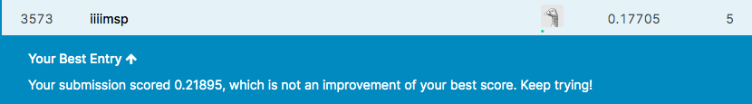

```{r setup, include=FALSE}
# Set default behavior for all code chunks here:
knitr::opts_chunk$set(
  echo = TRUE, 
  message = FALSE, 
  warning = FALSE, 
  fig.width = 16/2, 
  fig.height = 9/2
)

# Load all your used packages here:
library(tidyverse)
library(scales)

# Set seed value of random number generator here:
set.seed(76)

# Load data
training <- read_csv("data/train.csv")
test <- read_csv("data/test.csv")
sample_submission <- read_csv("data/sample_submission.csv")
```


***


# Implement cross-validation

For a CART model of the form `rpart(SalePrice ~ GrLivArea + HalfBath + YearBuilt)` and an arbitrarily chosen `cp` value, implement $k = 5$ fold cross-validation. Your code should:

1. Compute and display $\widehat{\text{RMSLE}}$, an estimate of the $\text{RMSLE}$ score Kaggle returns.
1. If you want to change $k$ to be some other value, you only need to change one line of code. For example, say I want to use $k = 10$ fold cross-validation instead. I should be able to do this by changing only the `k <- 5` below to `k <- 10`. This is known as "dynamically" coding `k`, instead of "hard-coding" `k`.

```{r}
library(rpart)
library(Metrics)
k <- 5

train <- training %>% 
  # This dplyr function will sample a fraction "size" of the rows at random.
  # Thus by setting size = 1 = 100%, we are effectively randomly reordering the 
  # rows.
  sample_frac(size = 1) %>% 
  # Assign fold values 1:5 for each row:
  mutate(fold = rep(1:k, length = n())) %>% 
  arrange(fold)

# Count the fold variable:
train %>% 
  count(fold)

# For each fold, we'll save the estimated RMSLE of the predictions here:
RMSLE_per_fold <- rep(0, length = k)

for(i in 1:k){
# Set the cross-validation training set to be folds 2-5
  train_cv <- train %>% 
    filter(fold != i)
  test_cv <- train %>% 
    filter(fold == i)

# Fit CART model on train_cv
  CART_cv <- rpart(SalePrice ~ GrLivArea + HalfBath + YearBuilt, 
                    data = train_cv, 
                    control = rpart.control(cp = 0))

# Make predictions on test_cv
  y_hat_cv <- predict(CART_cv, type = "vector", newdata = test_cv)

# Compute the RMSLE of predictions for the first fold and save
  RMSLE_per_fold[i] <- rmsle(test_cv$SalePrice, y_hat_cv) 
  }

RMSLE_per_fold
mean(RMSLE_per_fold)
```


***


# Run cross-validation on multiple cp values

Once you feel your implementation of cross-validation is correct, define a *search grid* `cp_search_grid` of multiple values of `cp` and return an estimate $\widehat{\text{RMSLE}}$ for each of the `cp` values in `cp_search_grid`. Your code should

1. Consider a search grid `cp_search_grid` of 101 different `cp` values.
1. Compute the 101 corresponding estimates $\widehat{\text{RMSLE}}$

```{r}
library(rpart)
library(Metrics)

# Create a table to store the cp search grid and the corresponding RMSLE estimate for each cp
cp_test_values <- tibble(cp_search_grid = seq(0, 0.05, length.out=101, RMSLE = 0))
cp_test_values

RMSLE_all_fold <- rep(0, length = nrow(cp_test_values))
RMSLE_per_fold2 <- rep(0, length = k)

for (j in 1:nrow(cp_test_values)) {
  cp <- cp_test_values$cp_search_grid[j]
  #RMSLE <- rep(0,101)
  for(i in 1:k){
    RMSLE <- rep(0,101)
    #Set the cross-validation training set to be folds 2-5
    train_cv <- train %>%
      filter(fold != i)
    #Set the cross-validation test set to be fold 1
    test_cv <- train %>%
      filter(fold == i)
    #Fit CART model on train_cv
    CART_cv <- rpart(SalePrice ~ GrLivArea + HalfBath + YearBuilt,
                     data = train_cv,
                     control = rpart.control(cp = cp)) 
    y_hat_cv2 <- predict(CART_cv, type = "vector", newdata = test_cv)
    RMSLE_per_fold2[i] <- rmsle(test_cv$SalePrice, y_hat_cv2) 
  }
   # Make predictions on test_cv
    RMSLE_all_fold[j] <- mean(RMSLE_per_fold2)
}

RMSLE_all_fold

cp_test_values <- add_column(cp_test_values, RMSLE_all_fold)
cp_test_values

```


***


# Identify optimal complexity parameter

Create a `geom_point()` scatterplot (using the `ggplot2` package) with your search grid `cp_search_grid` of 101 different `cp` values on the x-axis and 101 different estimates $\widehat{\text{RMSLE}}$ on the y-axis. 

```{r}
library(ggplot2)

p<-ggplot(cp_test_values, aes(x = cp_search_grid, y = RMSLE_all_fold)) +
  geom_point()
print(p + labs(y="Estimated RMSLE", x = "cp, from cp_search_grid") + ggtitle("CP and Estimated RMSLE"))
```

Then identify `cp_star`, the "optimal" value of `cp` that yields the smallest value of $\widehat{\text{RMSLE}}$.

```{r}
# Change 76 to your optimal value of cp
cp_test_values[which.min(cp_test_values$RMSLE_all_fold), ]

cp_star <- 5e-04
cp_star
```


***


# Kaggle score

## Create submission CSV

Using your `cp_star` "optimal" value of `cp`

1. Fit the same CART `rpart(SalePrice ~ GrLivArea + HalfBath + YearBuilt)` model
1. Plot the CART model
1. Make predictions on `test` in a `data/submissions.csv` CSV file that yields a valid Kaggle score in the [House Prices: Advanced Regression Techniques](https://www.kaggle.com/c/house-prices-advanced-regression-techniques/) competition.

```{r}
# Fit CART model here:
  CART_model <- rpart(log(SalePrice+1) ~ GrLivArea + HalfBath + YearBuilt, 
                    data = train, control = rpart.control(cp = cp_star))
```

```{r}
# Plot CART model here:
plot(CART_model, margin = 0.05)
text(CART_model, use.n = TRUE)
```

```{r}
# Make predictions here:
sub_predicted <- predict(CART_model, newdata = test)

submission <- test %>%
  select(Id) %>%
  mutate(SalePrice = exp(sub_predicted))

#submission$SalePrice <- exp(sub_predicted)
write_csv(submission, path = "data/submission.csv")
```


## Screenshot of Kaggle score

After making your submission on Kaggle, take a screenshot, and replace the image of my score with the image of yours below. Make sure it includes your name, your profile picture, and your score. 

{ width=100% }

{ width=100% }


## Comparison of estimated and Kaggle RMSLE

Compare the estimated $\widehat{\text{RMSLE}}$ with your actual Kaggle score. How different are they?


Lauren's Response: For my estimated $\widehat{\text{RMSLE}}$, I had a value of 0.2136967. My actual Kaggle score came out to be 0.21471. This means that there was a difference of 0.0010133 between my estimated $\widehat{\text{RMSLE}}$ and my actual Kaggle score, with my Kaggle score being slightly higher.

Iris' Response: the cp_star I got on my computer using the exact same codes is 0.0015, and the estimated $\widehat{\text{RMSLE}}$ is 0.21790. The actual Kaggle score is 0.21895, which means that the actual score was 0.00105 higher than my estimated score. The two scores were very close.
